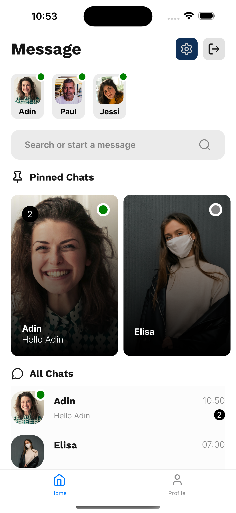
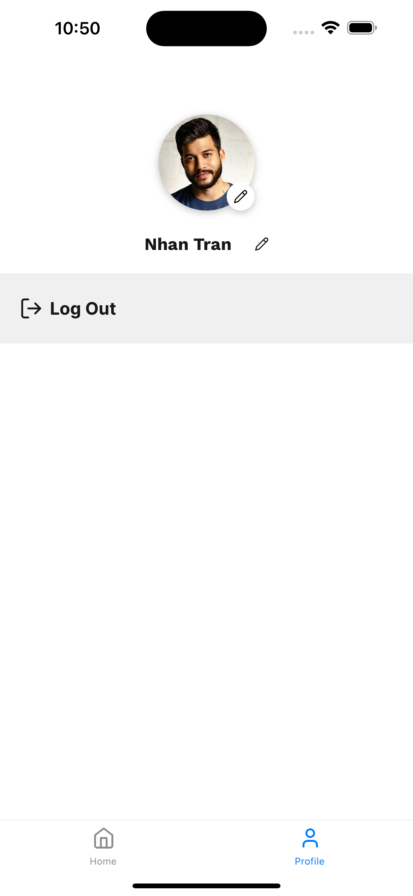
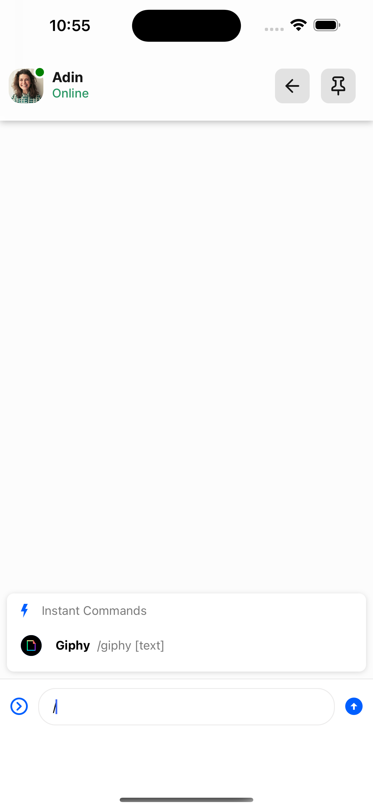
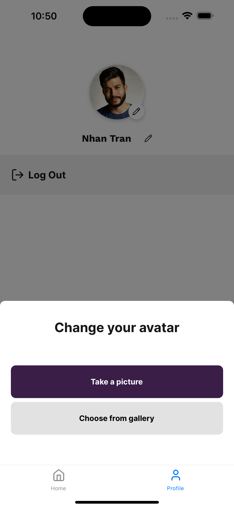
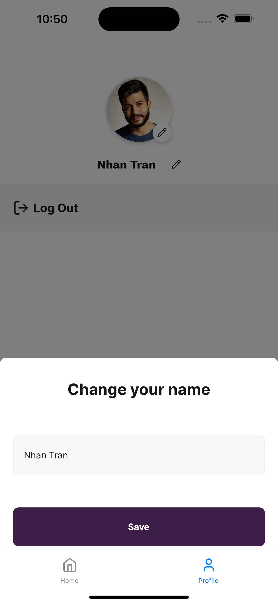

# Chat and pinned your message with GetStream

This is a React Chat App, help your chat with your friends. Using GetStream for the chat
Additional features:

- [GetStream](https://getstream.io/) for third party support chats and send message, gif, images
- [Firebse](https://firebase.google.com/) for authentication, database.
- [Tamagui](https://tamagui.dev/) for UI config
- [Expo Router](https://docs.expo.dev/router/introduction/) for router.
- [Lucide Icons](https://tamagui.dev/ui/lucide-icons/1.0.0) for icons

## Screenshotss

## Demo

